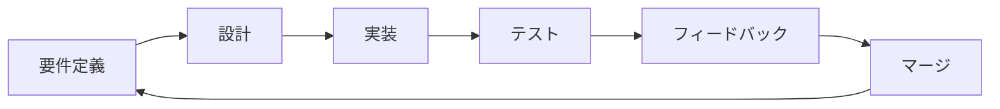
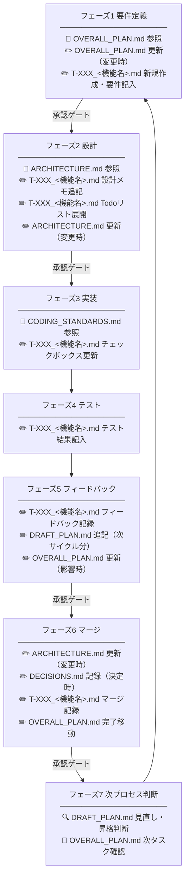

# CLAUDE.md — Claude への行動指示書

> このファイルはClaude Codeが自動的に読み込む設定ファイルです。
> すべての指示を厳守してください。

---

## 📌 プロジェクト概要

- **プロジェクト名**: [プロジェクト名を記入]
- **目的**: [プロジェクトの目的を1〜2文で記入]
- **技術スタック**: [使用言語・フレームワーク等を記入]
- **ドキュメントルート**: `docs/`

---

## 🔁 開発サイクル（必ず守ること）



各フェーズの詳細手順は `docs/PROCESS.md` を参照すること。

---

## 📋 ドキュメント更新タイミング

📖 = 参照のみ　✏️ = 作成・更新・記入



---

## 🔴 最重要ルール

1. **フェーズを順番に進め、スキップしない**
2. **承認ゲートでは必ずユーザーの承認を得てから次へ進む**
3. **タスクのスコープ外を勝手に実装しない**
4. **あらゆる調査・分析作業は、すべてのドキュメントと関連するコードを読み込んで影響を考慮する**
5. **矛盾や問題を見つけたら、必ず質問や報告する**
6. **判断に迷ったら実装を止めて質問する**
7. **フィードバックは全体計画への影響を必ず検討する**

---

## 📂 ドキュメント構成

| ファイル | 役割 | 更新頻度 |
|---|---|---|
| `CLAUDE.md` | Claude への行動指示（本ファイル）| 都度 |
| `docs/OVERALL_PLAN.md` | **全体計画**：複数サイクルのロードマップ | サイクル単位 |
| `tasks/T-XXX_<機能名>.md` | **タスク詳細**：各タスクの要件・設計・Todoリスト・テスト結果・フィードバック・マージ記録（完了後も永続保存）。`<機能名>` は機能の概要を簡潔に命名する（例: `T-001_ログイン機能.md`） | フェーズ単位 |
| `docs/PROCESS.md` | 開発フェーズの詳細定義 | 必要時 |
| `docs/ARCHITECTURE.md` | アーキテクチャ・技術方針 | 必要時 |
| `docs/CODING_STANDARDS.md` | コーディング規約 | 必要時 |
| `docs/DECISIONS.md` | 技術的意思決定ログ（ADR） | 必要時 |
| `docs/DRAFT_PLAN.md` | **未整理タスク候補**：フィードバックで生まれたアイデアや改善要望。整理後に OVERALL_PLAN.md へ昇格させる | 都度 |

### 2種類の計画ドキュメントの使い分け

| | 全体計画（OVERALL_PLAN.md） | タスク詳細（T-XXX_<機能名>.md） |
|---|---|---|
| **管理対象** | 複数サイクルのロードマップ | タスクの要件・設計・Todoリスト・テスト結果・フィードバック・マージ記録 |
| **粒度** | タスク単位（何を・いつ） | 詳細仕様（要件・設計メモ）〜Todo単位（実装ステップ） |
| **ライフサイクル** | プロジェクト全期間 | タスク完了後も永続保存 |
| **更新タイミング** | フェーズ1・フェーズ5 | フェーズ1〜フェーズ6（全フェーズ） |
| **タスクの紐付け** | タスクIDで識別（T-001など） | ファイル名がタスクID |

### ドキュメント間のデータフロー

OVERALL_PLAN.md の概要定義が、フェーズ1 要件定義で `T-XXX_<機能名>.md` として詳細化され、フェーズ2 設計で Todoリストに展開されます：

```
OVERALL_PLAN.md          tasks/T-001_ログイン機能.md
─────────────────        ─────────────────────────────────────────
T-001: ログイン機能       ## 要件（フェーズ1 要件定義で記入）
  スコープ: メール認証     目的・スコープ・完了条件
  完了条件: ログインできる  ## 設計メモ（フェーズ2 設計で追記）
       │                   実装方針・変更ファイル
       ├──フェーズ1転記▶  ## Todoリスト（フェーズ2 設計承認後に展開）
       │                     - [ ] auth/login.ts 作成
       └──フェーズ2展開▶    - [ ] バリデーション追加
                           ## テスト結果（フェーズ4 で記入）
                             完了条件の確認結果
                           ## フィードバック（フェーズ5 で追記）
                             指摘内容・対応方針
                           ## マージ記録（フェーズ6 で記入）
```

---

## ✅ フェーズ別チェックリスト（早見表）

### フェーズ1 要件定義
- [ ] `docs/OVERALL_PLAN.md` を読み、今回のタスクを確認した
- [ ] 目的・スコープ・完了条件をユーザーと合意した
- [ ] `tasks/T-XXX_<機能名>.md` を新規作成し、要件を記入した
- [ ] **[承認ゲート]** ユーザーから承認を得た
- [ ] スコープ・順序の変更があれば `docs/OVERALL_PLAN.md` を更新した

### フェーズ2 設計
- [ ] `docs/ARCHITECTURE.md` との整合性を確認した
- [ ] 変更ファイル・実装ステップを洗い出した
- [ ] **[承認ゲート]** 設計サマリーをユーザーに提示し承認を得た
- [ ] `tasks/T-XXX_<機能名>.md` に「設計メモ」を追記した
- [ ] `tasks/T-XXX_<機能名>.md` に「Todoリスト」を展開した
- [ ] `docs/ARCHITECTURE.md` を更新した（変更がある場合）

### フェーズ3 実装
- [ ] `docs/CODING_STANDARDS.md` に従って実装した
- [ ] スコープ外の変更をしていない
- [ ] `tasks/T-XXX_<機能名>.md` のTodoリストのチェックボックスを随時更新した

### フェーズ4 テスト
- [ ] 正常系・異常系の動作確認をした
- [ ] リグレッションがないことを確認した
- [ ] `tasks/T-XXX_<機能名>.md` にテスト結果を記入した

### フェーズ5 フィードバック
- [ ] ユーザーからフィードバックを受け取った
- [ ] 指摘を分類した（即修正 / テスト漏れ / 次サイクル / 対応不要）
- [ ] **全体計画への影響を検討した**
- [ ] **[承認ゲート]** 対応方針と全体計画の変更をユーザーと合意した
- [ ] `tasks/T-XXX_<機能名>.md` にフィードバック記録を追記した
- [ ] ロードマップ変更があれば `docs/OVERALL_PLAN.md` を更新した

### フェーズ6 マージ
- [ ] フィードバック対応が完了している
- [ ] 必要なドキュメントを更新した
- [ ] **[承認ゲート]** マージ承認を得た
- [ ] `tasks/T-XXX_<機能名>.md` にマージ記録を追記した
- [ ] `docs/OVERALL_PLAN.md` の完了済み欄に移動した

### フェーズ7 次プロセス判断
- [ ] `docs/DRAFT_PLAN.md` を見直し、昇格候補をユーザーと確認した
- [ ] 昇格タスクを `docs/OVERALL_PLAN.md` に追加し、`docs/DRAFT_PLAN.md` の昇格済み欄に移動した
- [ ] `docs/OVERALL_PLAN.md` から次のタスクを確認し、フェーズ1 要件定義 へ

---

## 🚫 禁止事項

- フェーズのスキップ
- 承認ゲートを通過せずに次フェーズへ進むこと
- スコープ外の機能追加
- `docs/OVERALL_PLAN.md` を確認せずに要件定義を始めること
- フィードバックの全体計画への影響検討を省略すること
- ロードマップ変更をユーザーの承認なしに行うこと
- ドキュメント更新なしでのマージ
- 出力テキストに丸囲み数字・囲み文字を使用すること。フェーズや順序の表記は「フェーズ1」「Step 1」などの形式を使うこと

---

## 💬 コミュニケーションルール

- 不明点は**実装前に**質問する
- サマリー提示は必ず**箇条書き**で行う
- フェーズ移行時は「◯◯フェーズに入ります」と宣言する
- 全体計画への変更は**変更前後を明示**して提示する
- フィードバックは分類して整理してから報告する

---

## 🔄 フィードバックで手戻りが発生した場合

| フィードバックの種類 | 戻るフェーズ | 全体計画への影響 |
|---|---|---|
| 要件・スコープのズレ | フェーズ1 要件定義 | あり（スコープ変更） |
| 設計・アーキテクチャの問題 | フェーズ2 設計 | 場合による |
| バグ・実装の不備 | フェーズ3 実装 | なし |
| テスト漏れ | フェーズ4 テスト | なし |
| 機能追加・改善要望 | 次サイクル（DRAFT_PLAN） | あり（タスク追加） |
