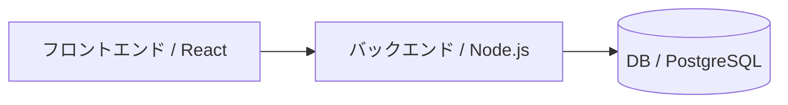
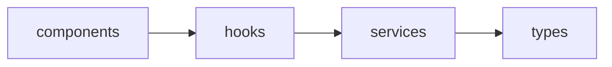

# ARCHITECTURE.md — アーキテクチャ・技術方針

> Claudeは実装前にこのドキュメントを参照し、方針に反する設計を行わないこと。
> 新たな技術的決定を行う場合は `docs/DECISIONS.md` に記録し、このドキュメントを更新すること。

---

## システム概要



---

## ディレクトリ構成

```
[プロジェクトのディレクトリ構成を記載]

例:
src/
├── components/   # UIコンポーネント
├── hooks/        # カスタムフック
├── services/     # API通信・ビジネスロジック
├── types/        # 型定義
└── utils/        # 汎用ユーティリティ
```

---

## 技術スタック

| カテゴリ | 採用技術 | 選定理由 |
|---|---|---|
| 言語 | [例: TypeScript] | [理由] |
| フレームワーク | [例: React] | [理由] |
| スタイリング | [例: Tailwind CSS] | [理由] |
| テスト | [例: Vitest] | [理由] |
| その他 | | |

---

## 設計原則

### 1. [原則名]
[説明]

例:
### 1. 単一責任の原則
各モジュール・コンポーネントは1つの責任のみを持つこと。
関数は50行以内を目安とし、複雑な処理は分割する。

### 2. [原則名]
[説明]

---

## 禁止事項（アーキテクチャ上）

- [ ] `services/` 以外からの直接API呼び出し
- [ ] コンポーネント内へのビジネスロジックの混在
- [ ] [プロジェクト固有の禁止事項を追記]

---

## モジュール間依存関係


※ 逆方向の依存は禁止

---

## 更新履歴

| 日付 | 変更内容 | 担当 |
|---|---|---|
| YYYY-MM-DD | 初版作成 | |
