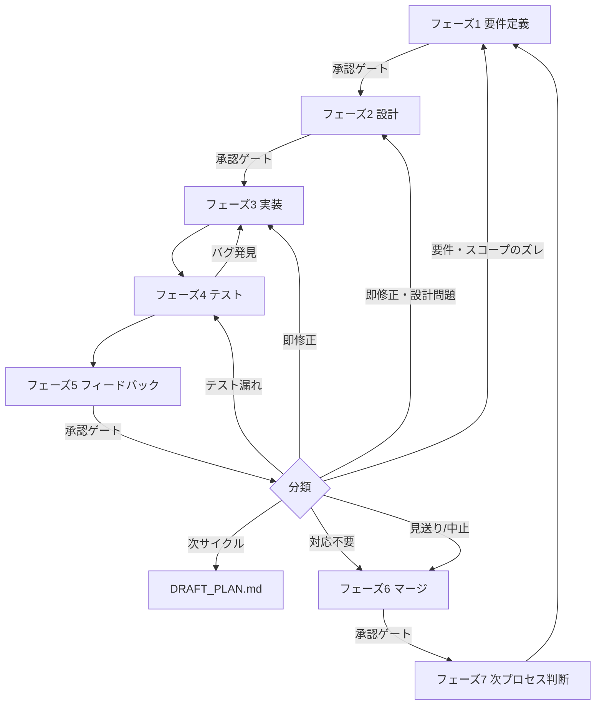
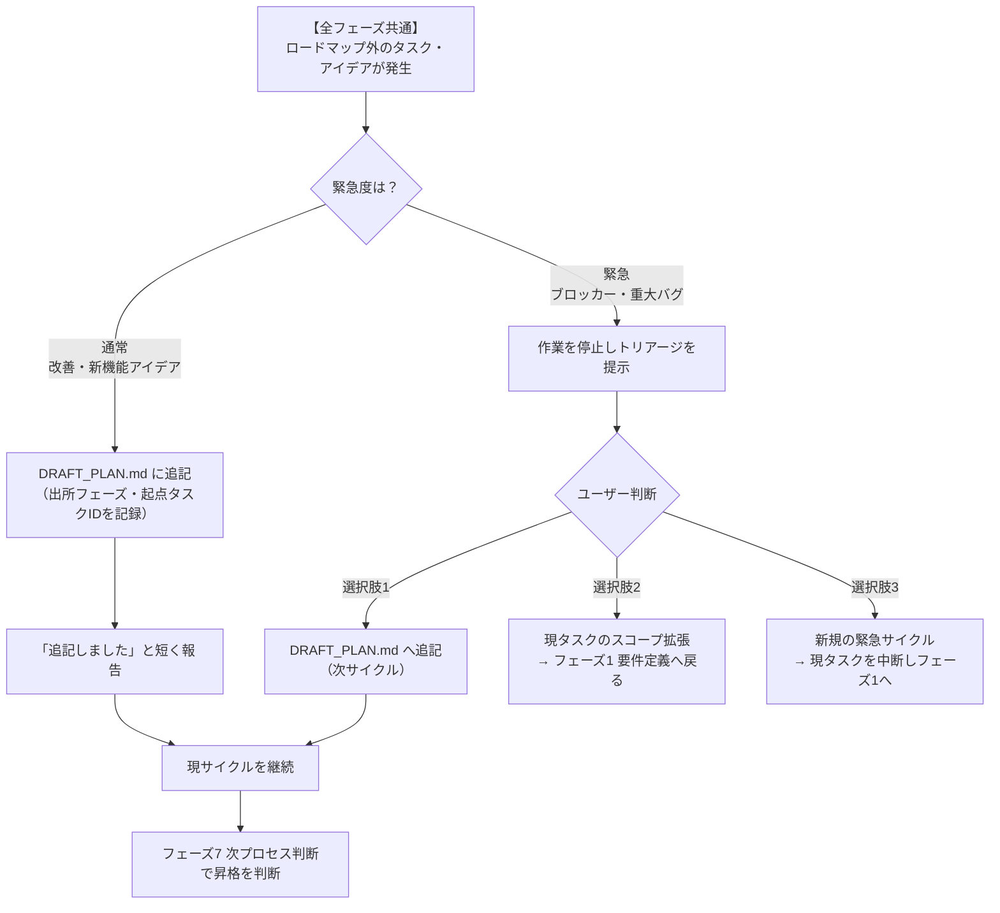
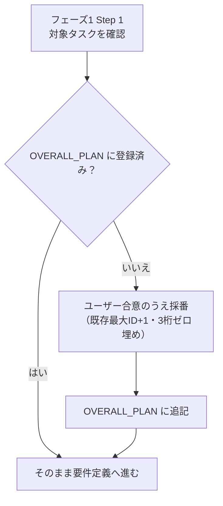
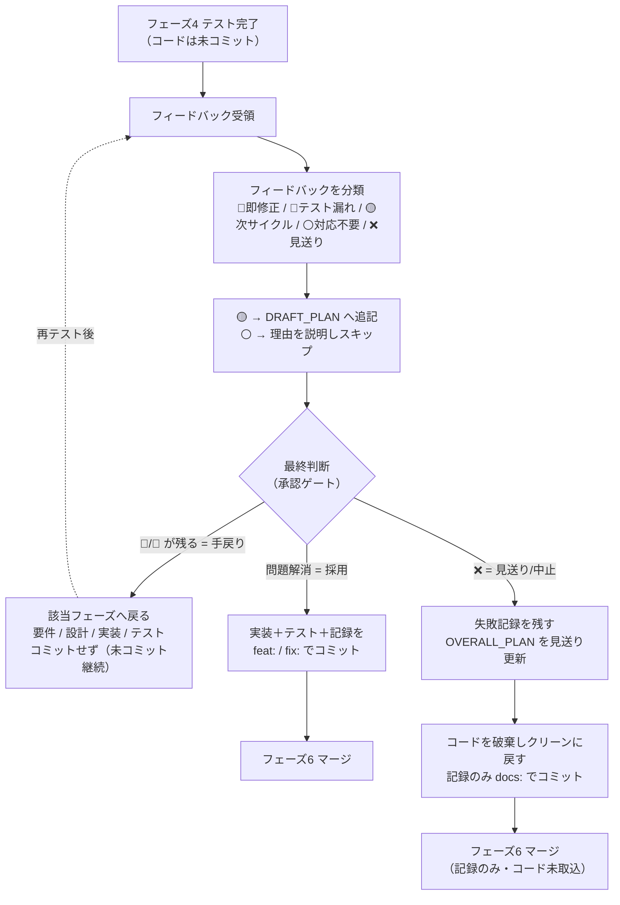

# PROCESS.md — 開発プロセス詳細定義

> Claudeはこのドキュメントに定義されたプロセスを厳守すること。
> フェーズのスキップ・承認ゲートの省略は禁止。

---

## サイクル全体図



> **実装（フェーズ3）とテスト（フェーズ4）の関係**: この2フェーズの間に承認ゲートは無い。実装→テストで失敗（バグ発見）したら実装へ戻る、という**ゲート無しの反復ループ**として回す。全テストケース合格でフェーズ5 フィードバックへ進む（修正を断念する場合も、その時点の結果を持ってフェーズ5で最終判断する）。
>
> **コミットのタイミング**: 実装・テストの成果はフェーズ4ではコミットせず、**フェーズ5の最終判断後**に行う（採用なら `feat:`/`fix:`、見送り/中止なら記録のみ `docs:`）。「テスト結果を含めた最終判断」と「コミットするか否か」を同じフェーズに揃えるため。フェーズを「分けている」のは作業の性質（作る／検証する／判断する）が違うためで、手続きを増やすためではない。

---

## Superpowers スキルの併用

このプロセスは、特定フェーズの「やり方（HOW）」を補強するために Superpowers のスキルを併用する。プロセスの「いつ・何を・どのゲートで（WHAT/WHEN）」は本ドキュメントが所有し続け、スキルはその中で起動する補助とする。**既存フェーズと衝突するフェーズには導入しない**方針で、以下の3点のみ採用する。

| フェーズ | 併用スキル | 役割 | 境界条件 |
|---|---|---|---|
| フェーズ3 実装 | `test-driven-development` | RED→GREEN→REFACTOR で実装を駆動する | 既存の「テスト設計を手元で回す」反復と一致。特別な上書きなし |
| フェーズ4 テスト | `systematic-debugging` | テスト NG 時に根本原因を特定してから修正する | フェーズ3へ戻る前に起動する |
| フェーズ7 次プロセス判断 | `brainstorming` | 複数の方針・候補の比較検討（方針検討）を駆動する | **writing-plans を自動起動しない**。設計ドキュメント（`docs/superpowers/specs/`）も作らない。出力は昇格判断（DRAFT → OVERALL_PLAN）に渡す |

### 導入しないもの（意図的な除外）

- **フェーズ1 要件定義 × brainstorming**: brainstorming の成果物（`docs/superpowers/specs/` の設計ドキュメント）と writing-plans 自動起動が、既存のフェーズ1（`tasks/T-XXX_<機能名>.md` の要件）・フェーズ2（設計メモ・Todo）と二重化・競合するため導入しない。要件ヒアリングは既存フロー（フェーズ1 Step 3）のまま行う。

### スキルと本プロセスの優先順位

- Superpowers のスキルより **本プロセス（`CLAUDE.md` / `docs/PROCESS.md`）の指示が優先**される（Superpowers 自身が「ユーザー指示が最優先」と定義している）。スキルの固定フローと本ドキュメントが食い違う場合は、上表の「境界条件」に従って本ドキュメントを優先する。
- この併用はベース整備の一環であり、各スキルの起動は対象が**コードを伴う作業**であることを前提とする（ドキュメントのみの作業では TDD・systematic-debugging は通常起動しない）。

---

## 全フェーズ共通：ロードマップ外タスク・アイデアの扱い

どのフェーズで作業していても、ロードマップ（`docs/OVERALL_PLAN.md`）に無いタスク・アイデアが出てくることがある。その場合は**緊急度で対応を分ける**。割り込みで現サイクルを脱線させない。

- **通常（改善・新機能アイデア）**: 現サイクルは止めず `docs/DRAFT_PLAN.md` に追記する。追記時に「出所フェーズ・起点タスクID」を残し、フェーズ7 次プロセス判断で昇格を判断する。停止や重い承認は不要で、「DRAFTに追記しました（出所: フェーズN / T-XXX）」と短く報告するだけでよい。
- **緊急（現タスクのブロッカー・重大バグ）**: 作業を停止し、以下のフォーマットでトリアージしてユーザーの判断を仰ぐ。

```
━━━━━━━━━━━━━━━━━━━━━━━━━━━━━━
⚠️ ロードマップ外タスクの発生
━━━━━━━━━━━━━━━━━━━━━━━━━━━━━━
発生フェーズ : フェーズN（T-XXX 作業中）
内容        : [概要]
緊急度      : 緊急（理由: ブロッカー / 重大バグ 等）
対応の選択肢 :
  選択肢1. DRAFT_PLAN.md へ追記（次サイクル）
  選択肢2. 現タスクのスコープを拡張（フェーズ1 要件定義へ戻る）
  選択肢3. 新規の緊急サイクルにする（現タスクを中断）
━━━━━━━━━━━━━━━━━━━━━━━━━━━━━━
▶ どの対応にしますか？
```

### フロー：発生時の振り分け



---

## フェーズ1 要件定義

### 目的
「何を・なぜ作るか」をユーザーと合意し、サイクルのゴールを定める。

### Claudeが行うこと

**Step 1: 現状確認と全体計画の参照**
- `docs/OVERALL_PLAN.md` を開き、ロードマップを確認する
- 「現在のサイクル」欄のタスクを今回の対象として認識する
- 前サイクルのタスク（`tasks/T-XXX_<機能名>.md`）がマージ完了済みであることを確認する
- 不明なタスクや優先度に疑問がある場合はユーザーに確認する
- 対象タスクが `docs/OVERALL_PLAN.md` に**未登録**の場合は、ユーザー合意のうえ採番して OVERALL_PLAN に追記してから着手する（次の Step 2 ブランチ作成も採番後の T-XXX を用いる）：
  - **採番ルール**: 既存の最大タスクID +1・3桁ゼロ埋め（例: 既存が T-004 なら次は `T-005`）
  - OVERALL_PLAN の「ロードマップ」「タスク定義」「更新ログ」に追記する



**Step 2: 作業用ブランチの作成**
- Step 1 で特定した対象タスクの ID（T-XXX）と機能名から、作業用ブランチ名 `feature/T-XXX_<機能名>` を決定する
- 要件ヒアリングに入る前に、以下を提示して承認を得る：
  ```
  ━━━━━━━━━━━━━━━━━━━━━━━━━━━━━━
  🌿 作業用ブランチの作成
  ━━━━━━━━━━━━━━━━━━━━━━━━━━━━━━
  対象タスク : T-XXX <機能名>
  ブランチ名 : feature/T-XXX_<機能名>
  作成元     : main
  ━━━━━━━━━━━━━━━━━━━━━━━━━━━━━━
  ▶ このブランチを作成して要件定義を開始してよいですか？
  ```
- 承認後、`main` を作成元に `feature/T-XXX_<機能名>` を作成しチェックアウトする
- 同名のブランチが既に存在する場合は新規作成せず、そのブランチに切り替える
- 未コミットの変更がある場合は、内容を確認してユーザーに対応を相談する（勝手にコミット・破棄しない）

**Step 3: 要件のヒアリング**
不明点があれば以下の観点で質問する（1度にまとめて聞く）：
- **目的**: この機能・修正で何を達成したいか
- **対象ユーザー**: 誰が使うか・どんな状況で使うか
- **スコープ内**: 今回のサイクルで実装すること
- **スコープ外**: 今回はやらないこと（明示的に定義する）
- **完了の定義（DoD）**: 何ができたら「完了」か
- **制約**: 技術・期限・依存関係

**Step 4: tasks/T-XXX_<機能名>.md の新規作成**
- 承認前に `tasks/T-XXX_<機能名>.md` を新規作成する
- ファイル名の `<機能名>` はタスクの概要を簡潔に命名する（例: `T-001_ログイン機能.md`）
- 要件定義の内容（目的・スコープ・完了条件・制約）を「## 要件」セクションに記入する
- ファイルには以下のセクションを設けておく（各フェーズで順に記入していく）：
  - `## 要件`（フェーズ1 要件定義で記入）
  - `## 設計メモ`（フェーズ2 設計で追記）
  - `## Todoリスト`（フェーズ2 設計承認後に展開）
  - `## テスト設計`（フェーズ2 設計で記入）
  - `## テスト結果`（フェーズ4 テストで記入）
  - `## フィードバック`（フェーズ5 フィードバックで追記）
  - `## マージ記録`（フェーズ6 マージで記入）

**Step 5: 要件定義サマリーの提示**
```
━━━━━━━━━━━━━━━━━━━━━━━━━━━━━━
📋 要件定義サマリー
━━━━━━━━━━━━━━━━━━━━━━━━━━━━━━
目的     : [1行で]
スコープ内:
  - [要件1]
  - [要件2]
スコープ外:
  - [やらないこと1]
完了条件 :
  - [ ] [条件1]
  - [ ] [条件2]
制約・前提: [あれば]
懸念点   : [あれば]
━━━━━━━━━━━━━━━━━━━━━━━━━━━━━━
▶ この要件定義で進めてよいですか？
```

**Step 6: 全体計画の更新（変更がある場合のみ）**
- 要件定義の結果、スコープや順序に変更が生じた場合は `docs/OVERALL_PLAN.md` を更新する
- 更新する場合は変更内容をユーザーに提示し確認を取る：
  ```
  ━━━━━━━━━━━━━━━━━━━━━━━━━━━━━━
  📋 全体計画の更新
  ━━━━━━━━━━━━━━━━━━━━━━━━━━━━━━
  変更内容: [変更前] → [変更後]
  理由    : [理由]
  ━━━━━━━━━━━━━━━━━━━━━━━━━━━━━━
  ▶ 全体計画を更新してよいですか？
  ```
- 承認後、`docs/OVERALL_PLAN.md` の更新ログに記録する

**Step 7: 要件ドキュメントのコミット（承認後）**
- 承認ゲート通過後、要件定義で作成・更新したドキュメントを Step 2 で作成した作業用ブランチにコミットする
- コミット対象：
  - `tasks/T-XXX_<機能名>.md`（今回新規作成した要件）
  - `docs/OVERALL_PLAN.md`（Step 6 で更新した場合のみ）
- コミットメッセージは `docs/CODING_STANDARDS.md` に従い `docs:` プレフィックスを用いる：
  ```
  docs: T-XXX <機能名> の要件定義を追加
  ```
- コミット後、ブランチ名・コミットメッセージ・対象ファイルを報告する

### 🔒 承認ゲート
- ユーザーから承認を得るまで設計フェーズに進まない
- 修正依頼があった場合はサマリーを修正して再提示する
- ブランチ作成（Step 2）と要件ドキュメントのコミット（Step 7）は、いずれも承認を得てから実施する

---

## フェーズ2 設計

### 目的
「どう作るか」を決め、実装前にリスクと影響範囲を把握する。

### Claudeが行うこと

**Step 1: 既存コードの調査**
- 関連ファイルを特定し、変更が必要な箇所を洗い出す
- `docs/ARCHITECTURE.md` を読み、設計方針との整合性を確認する
- 破壊的変更・副作用の有無を調査する

**Step 2: 実装アプローチの選定**
- 複数の実装案がある場合はトレードオフを比較する
- データ構造・インターフェース設計を決定する
- 新規ファイルの命名・配置場所を決める

**Step 3: 設計サマリーの提示**
```
━━━━━━━━━━━━━━━━━━━━━━━━━━━━━━
🏗️ 設計サマリー
━━━━━━━━━━━━━━━━━━━━━━━━━━━━━━
実装方針 : [アプローチを1〜2行で]
変更ファイル:
  - `path/to/file` — [変更内容]
新規作成 :
  - `path/to/new`  — [役割]
破壊的変更: あり / なし
実装ステップ:
  1. [ステップ1]
  2. [ステップ2]
テストケース概要:
  - [DoD1]: [確認するケース（正常系・異常系）]
  - [DoD2]: [確認するケース]
リスク   : [あれば]
━━━━━━━━━━━━━━━━━━━━━━━━━━━━━━
▶ この設計で進めてよいですか？
```

**Step 4: tasks/T-XXX_<機能名>.md への設計記録・Todoリスト展開・テスト設計（承認後）**
- `tasks/T-XXX_<機能名>.md` の「## 設計メモ」セクションに実装方針・変更ファイルを記入する
- 「## Todoリスト」セクションに以下の3カテゴリで具体的なTodoを展開する：

  ```
  #### 実装
  - [ ] `path/to/file` — [何をするか（1行で具体的に）]
  - [ ] `path/to/file` — [何をするか]

  #### テスト・確認
  - [ ] [完了条件1] の動作確認
  - [ ] リグレッション確認（影響ファイル: `path/to/file`）

  #### ドキュメント
  - [ ] `docs/ARCHITECTURE.md` 更新（変更があれば）
  - [ ] `docs/DECISIONS.md` 記録（技術的決定があれば）
  ```

- Todoの粒度の目安：1つのTodoが「1ファイルへの操作」または「1つの確認作業」になるレベル
- 実装中はTodoを完了するたびにチェックボックスを `[x]` に更新する
- 「## テスト設計」セクションに、完了条件（DoD）ごとのテストケースを記入する：
  - 各ケースに「対象DoD / 入力・操作 / 期待結果 / 区分（正常系・異常系）」を書く
  - **振る舞い・DoDレベル**で書き、実装詳細には紐づけない（設計変更での手戻りを防ぐ）
  - ここで作るのは**テストケース（仕様）まで**。テストコードの実装・実行はフェーズ3・フェーズ4で行う

**Step 5: 設計ドキュメントのコミット（承認後）**
- 承認ゲート通過後、設計フェーズで作成・更新したドキュメントをフェーズ1で作成した作業用ブランチにコミットする
- コミット対象：
  - `tasks/T-XXX_<機能名>.md`（設計メモ・Todoリスト・テスト設計を追記したもの）
  - `docs/ARCHITECTURE.md`（変更した場合のみ）
- コミットメッセージは `docs/CODING_STANDARDS.md` に従い `docs:` プレフィックスを用いる：
  ```
  docs: T-XXX <機能名> の設計メモ・Todoリスト・テスト設計を追加
  ```
- コミット後、ブランチ名・コミットメッセージ・対象ファイルを報告する

### 🔒 承認ゲート
- ユーザーから承認を得るまで実装フェーズに進まない
- 設計ドキュメントのコミット（Step 5）は承認を得てから実施する

---

## フェーズ3 実装

### 目的
設計に基づいてコードを書く。規約・スコープ・段階的進行を守る。フェーズ2のテスト設計を手元で回しながら作る（開発中のテストは実装の一部）。コミットはこの段階では行わず、フェーズ5の最終判断後にまとめて行う（採用なら実装＋テスト、見送りなら記録のみ）。

### Claudeが行うこと

**Step 1: コーディング規約の確認**
- `docs/CODING_STANDARDS.md` を参照する
- 命名規則・コメントルール・エラーハンドリング方針を確認する

**Step 2: 段階的な実装**
- 実装は `test-driven-development` スキルを起動して進める（RED: フェーズ2「## テスト設計」の該当ケースを先に書いて失敗を確認 → GREEN: 最小限の実装で通す → REFACTOR: 整理する）。以下の反復はこの規律に沿って回す（「Superpowers スキルの併用」セクション参照）
- 設計ステップの番号順に実装する
- 実装の各ステップで、フェーズ2「## テスト設計」の該当テストケースを随時実行して確認する（書く→テストを回す→直す、の反復は**このフェーズ内**で回す。失敗は実装の中で解消する）
- 1ステップ完了ごとに `tasks/T-XXX_<機能名>.md` のTodoリストのチェックボックスを更新し、進捗を報告する：
  ```
  ✅ Step 1 完了: [何をしたか]
  🔄 Step 2 実装中...
  ```

**Step 3: スコープ管理**
- 要件定義のスコープ外は実装しない
- スコープ外の問題・新たなアイデアを発見した場合は勝手に修正せず、「全フェーズ共通：ロードマップ外タスク・アイデアの扱い」に従う（通常は `docs/DRAFT_PLAN.md` に追記して現サイクル続行、緊急時は停止してトリアージ）：
  ```
  ⚠️ スコープ外の問題を発見: [内容]
  　 → 今回は対応しません。DRAFT_PLAN.md に追記します（出所: フェーズ3 / T-XXX）。
  ```

### 完了条件
- [ ] すべての実装ステップが完了している
- [ ] `docs/CODING_STANDARDS.md` に準拠している
- [ ] スコープ外の変更が含まれていない

---

## フェーズ4 テスト

### 目的
実装が要件を満たし、既存機能を壊していないことを最終確認する。フェーズ3の開発中テストとは別に、ここは**全テストケースの最終検証（フィードバックへの受け入れ確認）**にあたる。

### Claudeが行うこと

**Step 1: テスト設計に基づくテスト**
- フェーズ2 で作成した「## テスト設計」のテストケースを1つずつ実行する
- 各ケースの期待結果と実際の結果を照合し、正常系・異常系の両方を確認する
- テスト設計に無い観点に気づいた場合は、ケースを追記してから実行する（完了条件＝DoDの充足を必ず確認する）

**Step 2: リグレッションテスト**
- 変更ファイルに関連する既存機能が壊れていないか確認する
- 影響範囲が広い場合は範囲を明示して確認する

**Step 3: テスト結果の報告**
```
━━━━━━━━━━━━━━━━━━━━━━━━━━━━━━
🧪 テスト結果
━━━━━━━━━━━━━━━━━━━━━━━━━━━━━━
完了条件のテスト:
  ✅ [条件1]: [確認内容]
  ✅ [条件2]: [確認内容]
  ❌ [条件3]: [NG内容と原因]
リグレッション:
  ✅ 既存機能への影響なし
  ⚠️ [影響があった箇所と内容]
━━━━━━━━━━━━━━━━━━━━━━━━━━━━━━
```
- NG がある場合は、フェーズ3（実装）に戻る前に `systematic-debugging` スキルを起動して根本原因を特定し、原因に基づいて修正する（場当たり的な修正をしない。実装↔テストは承認ゲート無しで反復する。「Superpowers スキルの併用」セクション参照）
- 全テストケース合格＋リグレッションOKになったらフェーズ5 フィードバックへ進む
- 修正を断念する場合も、その時点のテスト結果を記録してフェーズ5 フィードバックで最終判断する
- テスト結果を `tasks/T-XXX_<機能名>.md` に記録する
- **この段階ではコミットしない**（コードは未コミットのまま。コミットはフェーズ5の最終判断後）

### 完了条件
- [ ] すべての完了条件がパスしている（またはNG内容・断念理由を報告済み）
- [ ] リグレッションがない（または報告済み）
- [ ] テスト結果を `tasks/T-XXX_<機能名>.md` に記録した

---

## フェーズ5 フィードバック

### 目的
ユーザーの評価を受け取り、対応方針を決めて次のアクションにつなげる。テスト結果を含めた最終判断（採用／手戻り／見送り）を行い、判断に応じてコミットする。

### フロー：フィードバックの最終判断



### Claudeが行うこと

**Step 1: フィードバックの受け取り**
- ユーザーに「フィードバックをください」と促す：
  ```
  テストが完了しました。実装内容をご確認いただき、
  フィードバックをお願いします。
  ```

**Step 2: フィードバックの分類と最終判断**
受け取ったフィードバックを以下に分類し、テスト結果も踏まえてタスク全体の最終判断（採用／手戻り／見送り）を行う：

| 分類 | 内容 | 対応 |
|---|---|---|
| 🔴 **即修正** | バグ・要件との乖離・重大な問題 | 内容に応じて要件定義・設計・実装フェーズに戻る |
| 🔵 **テスト漏れ** | テストケースの不足・カバレッジ不足 | テストフェーズに戻る |
| 🟡 **次サイクル** | 改善要望・追加機能・軽微な修正 | `DRAFT_PLAN.md` に追記する |
| ⚪ **対応不要** | 仕様通り・意図的な設計 | 理由を説明してスキップ |
| ❌ **見送り/中止** | 試行したが失敗・実現困難で、この機能自体を諦める | コードをクリーンに戻し、失敗記録のみ残してマージへ |

最終判断は次の3つのいずれか：
- **採用**: 問題が解消し取り込める → 実装＋テストをコミットしてマージへ
- **手戻り**: 🔴🔵 が残る → 該当フェーズへ戻る（コードは未コミットのまま）
- **見送り/中止**: ❌ → コードを破棄してクリーンに戻し、失敗記録のみコミットしてマージへ

**Step 3: フィードバック整理レポートの提示**
```
━━━━━━━━━━━━━━━━━━━━━━━━━━━━━━
💬 フィードバック整理
━━━━━━━━━━━━━━━━━━━━━━━━━━━━━━
🔴 即修正 (→ 内容に応じて要件定義・設計・実装フェーズへ戻る):
  - [指摘内容]: [対応方針]

🔵 テスト漏れ (→ テストフェーズへ戻る):
  - [指摘内容]: [追加するテストケース]

🟡 次サイクル (→ DRAFT_PLAN.md へ追記):
  - [指摘内容]: [追記するタスク名]

⚪ 対応不要:
  - [指摘内容]: [スキップ理由]

❌ 見送り/中止:
  - [理由]: [失敗の要点・実現困難の理由]

最終判断: [採用 → コミットしてマージへ / 手戻り → 要件定義/設計/実装/テストへ / 見送り → コードを破棄し記録のみ残してマージへ]
━━━━━━━━━━━━━━━━━━━━━━━━━━━━━━
▶ この対応方針でよいですか？
```

**Step 4: 対応の実施**
- 🔴 即修正の場合: 承認後、該当フェーズへ戻る（コードは未コミットのまま）
- 🔵 テスト漏れの場合: 承認後、テストフェーズへ戻る（コードは未コミットのまま）
- 🟡 次サイクルの場合: `docs/DRAFT_PLAN.md` に追記する
- ❌ 見送り/中止の場合: `tasks/T-XXX_<機能名>.md` の「## フィードバック」セクションに見送り理由・失敗の要点・学びを記録する（コードの破棄とコミットは Step 7 で実施）
- 全対応完了（採用）後: `tasks/T-XXX_<機能名>.md` の「## フィードバック」セクションにフィードバック内容と対応方針を記録し、マージフェーズへ進む

**Step 5: 全体計画への影響検討（必須）**
- フィードバック内容が `docs/OVERALL_PLAN.md` のロードマップに影響するか検討する
- 影響する場合（機能追加・スコープ変更・優先度変更など）は以下を提示する：
  ```
  ━━━━━━━━━━━━━━━━━━━━━━━━━━━━━━
  📋 全体計画への影響確認
  ━━━━━━━━━━━━━━━━━━━━━━━━━━━━━━
  フィードバック : [要約]
  ロードマップ影響: あり
  変更案:
    - [変更前の内容] → [変更後の内容]
  ━━━━━━━━━━━━━━━━━━━━━━━━━━━━━━
  ▶ 全体計画を更新しますか？
  ```
- 影響なしの場合も「影響なし」と明示的に報告する
- 見送り/中止の場合は、当該タスクを `docs/OVERALL_PLAN.md` で「見送り/中止」ステータスに更新する
- 承認後、`docs/OVERALL_PLAN.md` の更新ログに記録する

**Step 6: 全ドキュメントの状態・内容の確認・更新（承認後）**
最終判断の内容に合わせて、関連する全ドキュメントの状態・内容を確認し、必要なものを更新する（更新分は次の Step 7 でまとめてコミットする）。

| ドキュメント | 確認・更新する内容 |
|---|---|
| `tasks/T-XXX_<機能名>.md` | 要件・設計・テスト結果・フィードバックが最終状態と一致しているか |
| `docs/OVERALL_PLAN.md` | スコープ・ステータス・更新ログ（Step 5 の反映） |
| `docs/DRAFT_PLAN.md` | 🟡次サイクルの追記（Step 4 の反映） |
| `docs/ARCHITECTURE.md` | 実装で設計・技術方針が変わった場合に更新 |
| `docs/DECISIONS.md` | 採用した技術的決定があれば ADR を記録 |
| `docs/CODING_STANDARDS.md` | 規約の追加・変更が生じた場合に更新 |

- 各ドキュメントについて「更新あり／なし」を明示的に判断し、更新したものを報告する
- 見送り/中止の場合も、失敗から得た方針・教訓があれば `docs/DECISIONS.md` 等に残してよい

**Step 7: 最終判断に基づくコミット（承認後）**
最終判断に応じて、Step 6 で更新したドキュメントも含めて作業用ブランチにコミットする。
- **採用の場合**: 実装コード一式＋テストコード＋Step 6 で更新した全ドキュメント（`tasks/T-XXX_<機能名>.md`・`docs/ARCHITECTURE.md`・`docs/DECISIONS.md` 等）を、タスク種別に応じて `feat:`（新機能）/`fix:`（バグ修正）でコミットする：
  ```
  feat: T-XXX <機能名> を実装（テスト含む）
  ```
- **見送り/中止の場合**: 未コミットの実装・テストコードを破棄してクリーンな状態に戻し、Step 6 で更新したドキュメント（`tasks/T-XXX_<機能名>.md` の失敗記録・学び等）のみを `docs:` でコミットする：
  ```
  docs: T-XXX <機能名> を見送り（試行結果を記録）
  ```
- **手戻りの場合**: コミットせず、該当フェーズへ戻る（コードは未コミットのまま継続）
- コミット後、ブランチ名・コミットメッセージ・対象ファイルを報告する

### 🔒 承認ゲート
- 対応方針と全体計画への変更についてユーザーの承認を得てから実施する
- ドキュメントの更新（Step 6）とコードのコミット・破棄（Step 7）は、最終判断の承認を得てから実施する

---

## フェーズ6 マージ

### 目的
変更を正式にメインブランチへ取り込む。実装・テスト・ドキュメント更新・コミットはフェーズ5までに完了済みで、フェーズ6は **main への統合とマージ起因の記録**（マージ記録・完了移動）に専念する。main マージ専用の承認ゲートを持つ点に存在意義がある。

### Claudeが行うこと

**Step 1: マージ前チェックリスト**
```
━━━━━━━━━━━━━━━━━━━━━━━━━━━━━━
🔍 マージ前チェック
━━━━━━━━━━━━━━━━━━━━━━━━━━━━━━
実装      : ✅ / ❌
テスト    : ✅ / ❌
フィードバック対応: ✅ / ❌
コード品質 : ✅ / ❌ [指摘があれば]
ドキュメント更新: ✅ / ❌ [更新箇所]
━━━━━━━━━━━━━━━━━━━━━━━━━━━━━━
▶ マージしてよいですか？
```
- 「ドキュメント更新」の確認は、更新の実体ではなくフェーズ5 Step 6 で更新・コミット済みかの確認である。漏れ（`docs/ARCHITECTURE.md`・`docs/DECISIONS.md` 等の未更新）があれば、フェーズ5に戻って更新・コミットしてからマージに進む

### 🔒 承認ゲート（マージ実行前）
- すべてのチェックが ✅ であることを確認してからユーザーへ提示する
- 見送り/中止の場合は、実装・テストが ❌ のままでよい。代わりに「コードがクリーンに戻っている」「失敗記録が残っている」ことを確認する
- ユーザーの承認を得てから Step 2 のマージを実行する

**Step 2: マージの実行**
- 承認後、ブランチをマージする
- 見送り/中止の場合は、**失敗記録のみを含むブランチ**をマージする（コードは破棄済みのため main には取り込まれない）

**Step 3: マージ後の処理**
- `tasks/T-XXX_<機能名>.md` にマージ記録を追記する（マージ日時・マージ先ブランチ・更新ドキュメント）
- `docs/OVERALL_PLAN.md` の「現在のサイクル」欄から、完了タスクを「完了済み」欄へ移動する（見送り/中止の場合は「見送り/中止」として記録する）
- 上記のマージ記録・完了移動を `docs/CODING_STANDARDS.md` に従い `docs:` でコミットする（マージ起因のドキュメント更新を未コミットで残さない）：
  ```
  docs: T-XXX <機能名> のマージ記録・完了移動を記録
  ```

---

## フェーズ7 次プロセス判断

### 目的
次に取り組むタスクを決定し、次サイクルへ移行する。

### Claudeが行うこと

**Step 1: DRAFT_PLAN.md の見直しと昇格判断**
- 複数の方針・候補を比較検討する場合は `brainstorming` スキルを起動し、2〜3案のトレードオフを出して方針を絞る（方針検討。「Superpowers スキルの併用」セクション参照）。ただし **writing-plans は自動起動せず**、設計ドキュメント（`docs/superpowers/specs/`）も作らない。これは個別タスクの設計（フェーズ1〜2）ではなくロードマップ level の方針検討であり、検討結果は下記の昇格判断（DRAFT → OVERALL_PLAN）に渡す
- `docs/DRAFT_PLAN.md` のタスク候補を確認し、OVERALL_PLAN.md に昇格させるものをユーザーに提案する：
  ```
  ━━━━━━━━━━━━━━━━━━━━━━━━━━━━━━
  📋 DRAFT_PLAN.md 見直し
  ━━━━━━━━━━━━━━━━━━━━━━━━━━━━━━
  昇格候補:
    - [タスク名]: [概要] → OVERALL_PLAN.md に追加しますか？
  見送り候補:
    - [タスク名]: 引き続き DRAFT_PLAN.md に保留
  ━━━━━━━━━━━━━━━━━━━━━━━━━━━━━━
  ▶ 昇格するタスクを確認してください
  ```
- 承認後、昇格タスクを `docs/OVERALL_PLAN.md` に追加し、`docs/DRAFT_PLAN.md` の「昇格済み」欄に移動する

### 🔒 承認ゲート
- 昇格するタスク（および保留の判断）についてユーザーの承認を得てから `docs/OVERALL_PLAN.md` へ反映する
- 承認を得るまで `docs/OVERALL_PLAN.md` は更新しない

**Step 2: 次サイクルの開始**
- `docs/OVERALL_PLAN.md` のロードマップから次のタスクをユーザーに提示する：
  ```
  ━━━━━━━━━━━━━━━━━━━━━━━━━━━━━━
  ✅ サイクル完了！
  ━━━━━━━━━━━━━━━━━━━━━━━━━━━━━━
  実施内容: [サマリー]

  次のサイクル候補（OVERALL_PLAN.mdより）:
    1. [タスク名] — [概要]
    2. [タスク名] — [概要]

  次は何に取り組みますか？
  ━━━━━━━━━━━━━━━━━━━━━━━━━━━━━━
  ```

**Step 3: フェーズ1 へ戻る**
- ユーザーが次のタスクを選んだら、フェーズ1 要件定義 へ戻る

---

## フィードバックによる手戻り対応表

| フィードバックの内容 | 戻るフェーズ | 備考 |
|---|---|---|
| 要件・スコープのズレ | フェーズ1 要件定義 | 要件サマリーを修正して再合意 |
| 設計・アーキテクチャの問題 | フェーズ2 設計 | 設計サマリーを修正して再合意 |
| バグ・実装の不備 | フェーズ3 実装 | 修正後にフェーズ4 テストから再実施 |
| テスト漏れ | フェーズ4 テスト | テスト追加後にフェーズ5 フィードバックへ |
| 機能追加・改善要望 | 次サイクル（DRAFT_PLAN） | `docs/DRAFT_PLAN.md` に追記し次サイクルで対応 |
| 試行失敗・実現困難（見送り/中止） | フェーズ6 マージ（記録のみ） | コードを破棄してクリーンに戻し、失敗記録だけを `docs:` でコミットしてマージ |
