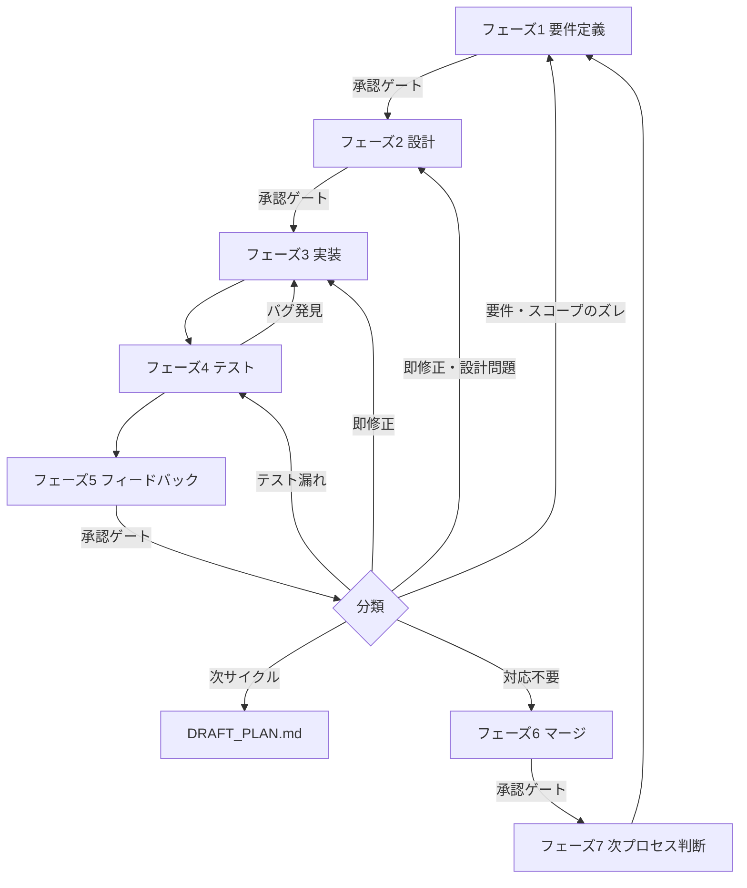

# PROCESS.md — 開発プロセス詳細定義

> Claudeはこのドキュメントに定義されたプロセスを厳守すること。
> フェーズのスキップ・承認ゲートの省略は禁止。

---

## サイクル全体図



---

## フェーズ1 要件定義

### 目的
「何を・なぜ作るか」をユーザーと合意し、サイクルのゴールを定める。

### Claudeが行うこと

**Step 1: 現状確認と全体計画の参照**
- `docs/OVERALL_PLAN.md` を開き、ロードマップを確認する
- 「現在のサイクル」欄のタスクを今回の対象として認識する
- 前サイクルのタスク（`tasks/T-XXX_<機能名>.md`）がマージ完了済みであることを確認する
- 不明なタスクや優先度に疑問がある場合はユーザーに確認する

**Step 2: 要件のヒアリング**
不明点があれば以下の観点で質問する（1度にまとめて聞く）：
- **目的**: この機能・修正で何を達成したいか
- **対象ユーザー**: 誰が使うか・どんな状況で使うか
- **スコープ内**: 今回のサイクルで実装すること
- **スコープ外**: 今回はやらないこと（明示的に定義する）
- **完了の定義（DoD）**: 何ができたら「完了」か
- **制約**: 技術・期限・依存関係

**Step 3: tasks/T-XXX_<機能名>.md の新規作成**
- 承認前に `tasks/T-XXX_<機能名>.md` を新規作成する
- ファイル名の `<機能名>` はタスクの概要を簡潔に命名する（例: `T-001_ログイン機能.md`）
- 要件定義の内容（目的・スコープ・完了条件・制約）を「## 要件」セクションに記入する
- ファイルには以下のセクションを設けておく（各フェーズで順に記入していく）：
  - `## 要件`（フェーズ1 要件定義で記入）
  - `## 設計メモ`（フェーズ2 設計で追記）
  - `## Todoリスト`（フェーズ2 設計承認後に展開）
  - `## テスト結果`（フェーズ4 テストで記入）
  - `## フィードバック`（フェーズ5 フィードバックで追記）
  - `## マージ記録`（フェーズ6 マージで記入）

**Step 4: 要件定義サマリーの提示**
```
━━━━━━━━━━━━━━━━━━━━━━━━━━━━━━
📋 要件定義サマリー
━━━━━━━━━━━━━━━━━━━━━━━━━━━━━━
目的     : [1行で]
スコープ内:
  - [要件1]
  - [要件2]
スコープ外:
  - [やらないこと1]
完了条件 :
  - [ ] [条件1]
  - [ ] [条件2]
制約・前提: [あれば]
懸念点   : [あれば]
━━━━━━━━━━━━━━━━━━━━━━━━━━━━━━
▶ この要件定義で進めてよいですか？
```

**Step 5: 全体計画の更新（変更がある場合のみ）**
- 要件定義の結果、スコープや順序に変更が生じた場合は `docs/OVERALL_PLAN.md` を更新する
- 更新する場合は変更内容をユーザーに提示し確認を取る：
  ```
  ━━━━━━━━━━━━━━━━━━━━━━━━━━━━━━
  📋 全体計画の更新
  ━━━━━━━━━━━━━━━━━━━━━━━━━━━━━━
  変更内容: [変更前] → [変更後]
  理由    : [理由]
  ━━━━━━━━━━━━━━━━━━━━━━━━━━━━━━
  ▶ 全体計画を更新してよいですか？
  ```
- 承認後、`docs/OVERALL_PLAN.md` の更新ログに記録する

### 🔒 承認ゲート
- ユーザーから承認を得るまで設計フェーズに進まない
- 修正依頼があった場合はサマリーを修正して再提示する

---

## フェーズ2 設計

### 目的
「どう作るか」を決め、実装前にリスクと影響範囲を把握する。

### Claudeが行うこと

**Step 1: 既存コードの調査**
- 関連ファイルを特定し、変更が必要な箇所を洗い出す
- `docs/ARCHITECTURE.md` を読み、設計方針との整合性を確認する
- 破壊的変更・副作用の有無を調査する

**Step 2: 実装アプローチの選定**
- 複数の実装案がある場合はトレードオフを比較する
- データ構造・インターフェース設計を決定する
- 新規ファイルの命名・配置場所を決める

**Step 3: 設計サマリーの提示**
```
━━━━━━━━━━━━━━━━━━━━━━━━━━━━━━
🏗️ 設計サマリー
━━━━━━━━━━━━━━━━━━━━━━━━━━━━━━
実装方針 : [アプローチを1〜2行で]
変更ファイル:
  - `path/to/file` — [変更内容]
新規作成 :
  - `path/to/new`  — [役割]
破壊的変更: あり / なし
実装ステップ:
  1. [ステップ1]
  2. [ステップ2]
リスク   : [あれば]
━━━━━━━━━━━━━━━━━━━━━━━━━━━━━━
▶ この設計で進めてよいですか？
```

**Step 4: tasks/T-XXX_<機能名>.md への設計記録・Todoリスト展開（承認後）**
- `tasks/T-XXX_<機能名>.md` の「## 設計メモ」セクションに実装方針・変更ファイルを記入する
- 「## Todoリスト」セクションに以下の3カテゴリで具体的なTodoを展開する：

  ```
  #### 実装
  - [ ] `path/to/file` — [何をするか（1行で具体的に）]
  - [ ] `path/to/file` — [何をするか]

  #### テスト・確認
  - [ ] [完了条件1] の動作確認
  - [ ] リグレッション確認（影響ファイル: `path/to/file`）

  #### ドキュメント
  - [ ] `docs/ARCHITECTURE.md` 更新（変更があれば）
  - [ ] `docs/DECISIONS.md` 記録（技術的決定があれば）
  ```

- Todoの粒度の目安：1つのTodoが「1ファイルへの操作」または「1つの確認作業」になるレベル
- 実装中はTodoを完了するたびにチェックボックスを `[x]` に更新する

### 🔒 承認ゲート
- ユーザーから承認を得るまで実装フェーズに進まない

---

## フェーズ3 実装

### 目的
設計に基づいてコードを書く。規約・スコープ・段階的進行を守る。

### Claudeが行うこと

**Step 1: コーディング規約の確認**
- `docs/CODING_STANDARDS.md` を参照する
- 命名規則・コメントルール・エラーハンドリング方針を確認する

**Step 2: 段階的な実装**
- 設計ステップの番号順に実装する
- 1ステップ完了ごとに `tasks/T-XXX_<機能名>.md` のTodoリストのチェックボックスを更新し、進捗を報告する：
  ```
  ✅ Step 1 完了: [何をしたか]
  🔄 Step 2 実装中...
  ```

**Step 3: スコープ管理**
- 要件定義のスコープ外は実装しない
- スコープ外の問題を発見した場合は「報告のみ」し、勝手に修正しない：
  ```
  ⚠️ スコープ外の問題を発見: [内容]
  　 → 今回は対応しません。DRAFT_PLAN.md に追記してよいですか？
  ```

### 完了条件
- [ ] すべての実装ステップが完了している
- [ ] `docs/CODING_STANDARDS.md` に準拠している
- [ ] スコープ外の変更が含まれていない

---

## フェーズ4 テスト

### 目的
実装が要件を満たし、既存機能を壊していないことを確認する。

### Claudeが行うこと

**Step 1: 要件定義の完了条件に対するテスト**
- フェーズ1 で定義した「完了条件」を1つずつ確認する
- 正常系・異常系の両方をテストする

**Step 2: リグレッションテスト**
- 変更ファイルに関連する既存機能が壊れていないか確認する
- 影響範囲が広い場合は範囲を明示して確認する

**Step 3: テスト結果の報告**
```
━━━━━━━━━━━━━━━━━━━━━━━━━━━━━━
🧪 テスト結果
━━━━━━━━━━━━━━━━━━━━━━━━━━━━━━
完了条件のテスト:
  ✅ [条件1]: [確認内容]
  ✅ [条件2]: [確認内容]
  ❌ [条件3]: [NG内容と原因]
リグレッション:
  ✅ 既存機能への影響なし
  ⚠️ [影響があった箇所と内容]
━━━━━━━━━━━━━━━━━━━━━━━━━━━━━━
```
- NG がある場合はフェーズ3（実装）に戻る
- テスト結果を `tasks/T-XXX_<機能名>.md` に記録する

### 完了条件
- [ ] すべての完了条件がパスしている（またはNG内容を報告済み）
- [ ] リグレッションがない（または報告済み）
- [ ] テスト結果を `tasks/T-XXX_<機能名>.md` に記録した

---

## フェーズ5 フィードバック

### 目的
ユーザーの評価を受け取り、対応方針を決めて次のアクションにつなげる。

### Claudeが行うこと

**Step 1: フィードバックの受け取り**
- ユーザーに「フィードバックをください」と促す：
  ```
  テストが完了しました。実装内容をご確認いただき、
  フィードバックをお願いします。
  ```

**Step 2: フィードバックの分類**
受け取ったフィードバックを以下の4種類に分類して整理する：

| 分類 | 内容 | 対応 |
|---|---|---|
| 🔴 **即修正** | バグ・要件との乖離・重大な問題 | 内容に応じて要件定義・設計・実装フェーズに戻る |
| 🔵 **テスト漏れ** | テストケースの不足・カバレッジ不足 | テストフェーズに戻る |
| 🟡 **次サイクル** | 改善要望・追加機能・軽微な修正 | `DRAFT_PLAN.md` に追記する |
| ⚪ **対応不要** | 仕様通り・意図的な設計 | 理由を説明してスキップ |

**Step 3: フィードバック整理レポートの提示**
```
━━━━━━━━━━━━━━━━━━━━━━━━━━━━━━
💬 フィードバック整理
━━━━━━━━━━━━━━━━━━━━━━━━━━━━━━
🔴 即修正 (→ 内容に応じて要件定義・設計・実装フェーズへ戻る):
  - [指摘内容]: [対応方針]

🔵 テスト漏れ (→ テストフェーズへ戻る):
  - [指摘内容]: [追加するテストケース]

🟡 次サイクル (→ DRAFT_PLAN.md へ追記):
  - [指摘内容]: [追記するタスク名]

⚪ 対応不要:
  - [指摘内容]: [スキップ理由]

次のアクション: [即修正 → 要件定義/設計/実装へ / テスト漏れ → テストへ / 全対応完了 → マージへ]
━━━━━━━━━━━━━━━━━━━━━━━━━━━━━━
▶ この対応方針でよいですか？
```

**Step 4: 対応の実施**
- 🔴 即修正の場合: 承認後、該当フェーズへ戻る
- 🔵 テスト漏れの場合: 承認後、テストフェーズへ戻る
- 🟡 次サイクルの場合: `docs/DRAFT_PLAN.md` に追記する
- 全対応完了後: `tasks/T-XXX_<機能名>.md` の「## フィードバック」セクションにフィードバック内容と対応方針を記録し、マージフェーズへ進む

**Step 5: 全体計画への影響検討（必須）**
- フィードバック内容が `docs/OVERALL_PLAN.md` のロードマップに影響するか検討する
- 影響する場合（機能追加・スコープ変更・優先度変更など）は以下を提示する：
  ```
  ━━━━━━━━━━━━━━━━━━━━━━━━━━━━━━
  📋 全体計画への影響確認
  ━━━━━━━━━━━━━━━━━━━━━━━━━━━━━━
  フィードバック : [要約]
  ロードマップ影響: あり
  変更案:
    - [変更前の内容] → [変更後の内容]
  ━━━━━━━━━━━━━━━━━━━━━━━━━━━━━━
  ▶ 全体計画を更新しますか？
  ```
- 影響なしの場合も「影響なし」と明示的に報告する
- 承認後、`docs/OVERALL_PLAN.md` の更新ログに記録する

### 🔒 承認ゲート
- 対応方針と全体計画への変更についてユーザーの承認を得てから実施する

---

## フェーズ6 マージ

### 目的
レビューを完了し、変更を正式にメインブランチへ取り込む。

### Claudeが行うこと

**Step 1: マージ前チェックリスト**
```
━━━━━━━━━━━━━━━━━━━━━━━━━━━━━━
🔍 マージ前チェック
━━━━━━━━━━━━━━━━━━━━━━━━━━━━━━
実装      : ✅ / ❌
テスト    : ✅ / ❌
フィードバック対応: ✅ / ❌
コード品質 : ✅ / ❌ [指摘があれば]
ドキュメント更新: ✅ / ❌ [更新箇所]
━━━━━━━━━━━━━━━━━━━━━━━━━━━━━━
▶ マージしてよいですか？
```

**Step 2: ドキュメントの更新**
- 重要な技術的決定があれば `docs/DECISIONS.md` に記録する
- アーキテクチャ変更があれば `docs/ARCHITECTURE.md` を更新する

**Step 3: マージの実行**
- 承認後、ブランチをマージする

**Step 4: マージ後の処理**
- `tasks/T-XXX_<機能名>.md` にマージ記録を追記する（マージ日時・マージ先ブランチ・更新ドキュメント）
- `docs/OVERALL_PLAN.md` の「現在のサイクル」欄から完了タスクを「完了済み」欄に移動する

### 🔒 承認ゲート
- すべてのチェックが ✅ であることを確認してからユーザーへ提示する
- ユーザーの承認を得てからマージを実行する

---

## フェーズ7 次プロセス判断

### 目的
次に取り組むタスクを決定し、次サイクルへ移行する。

### Claudeが行うこと

**Step 1: DRAFT_PLAN.md の見直しと昇格判断**
- `docs/DRAFT_PLAN.md` のタスク候補を確認し、OVERALL_PLAN.md に昇格させるものをユーザーに提案する：
  ```
  ━━━━━━━━━━━━━━━━━━━━━━━━━━━━━━
  📋 DRAFT_PLAN.md 見直し
  ━━━━━━━━━━━━━━━━━━━━━━━━━━━━━━
  昇格候補:
    - [タスク名]: [概要] → OVERALL_PLAN.md に追加しますか？
  見送り候補:
    - [タスク名]: 引き続き DRAFT_PLAN.md に保留
  ━━━━━━━━━━━━━━━━━━━━━━━━━━━━━━
  ▶ 昇格するタスクを確認してください
  ```
- 承認後、昇格タスクを `docs/OVERALL_PLAN.md` に追加し、`docs/DRAFT_PLAN.md` の「昇格済み」欄に移動する

**Step 2: 次サイクルの開始**
- `docs/OVERALL_PLAN.md` のロードマップから次のタスクをユーザーに提示する：
  ```
  ━━━━━━━━━━━━━━━━━━━━━━━━━━━━━━
  ✅ サイクル完了！
  ━━━━━━━━━━━━━━━━━━━━━━━━━━━━━━
  実施内容: [サマリー]

  次のサイクル候補（OVERALL_PLAN.mdより）:
    1. [タスク名] — [概要]
    2. [タスク名] — [概要]

  次は何に取り組みますか？
  ━━━━━━━━━━━━━━━━━━━━━━━━━━━━━━
  ```

**Step 3: フェーズ1 へ戻る**
- ユーザーが次のタスクを選んだら、フェーズ1 要件定義 へ戻る

---

## フィードバックによる手戻り対応表

| フィードバックの内容 | 戻るフェーズ | 備考 |
|---|---|---|
| 要件・スコープのズレ | フェーズ1 要件定義 | 要件サマリーを修正して再合意 |
| 設計・アーキテクチャの問題 | フェーズ2 設計 | 設計サマリーを修正して再合意 |
| バグ・実装の不備 | フェーズ3 実装 | 修正後にフェーズ4 テストから再実施 |
| テスト漏れ | フェーズ4 テスト | テスト追加後にフェーズ5 フィードバックへ |
| 機能追加・改善要望 | 次サイクル（DRAFT_PLAN） | `docs/DRAFT_PLAN.md` に追記し次サイクルで対応 |
